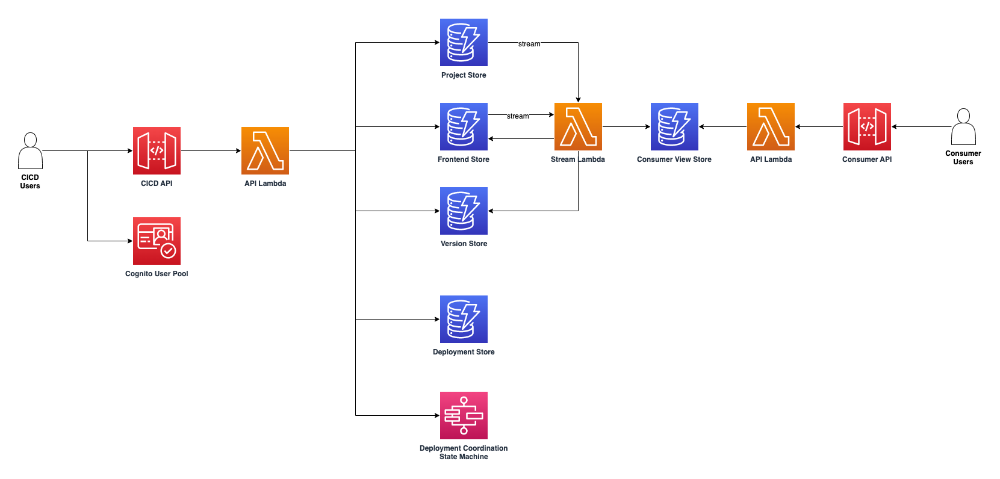

<h1 align="center">
    Frontend Service Discovery on AWS
     
    
    
</h1>

Frontend Service Discovery on AWS is a solution to handle frontend releases on AWS using the [frontend discovery pattern](https://github.com/awslabs/frontend-discovery).

The **frontend discovery pattern** improves the development experience when developing, testing, and delivering micro-frontends by making use of a shareable configuration describing the entry point of micro-frontends, as well as additional metadata that is used to deploy in every environment safely using Canary Releases.

Modern frontend development consist of using a wide variety of tools and libraries to allow modularity during development, coupled with complex systems that optimise code to run in production with performance and robustness in mind. Traditionally, this process consisted of bundling code into individual files that could be hosted in a CDN with the goal of reducing network calls at minimum during run-time, both during initial load (when an app opens in a browser) and during usage (when a customer starts using the app performing actions such as clicking buttons, inserting information, and more).

One of the challenges that micro-frontends architectures solve is the problem of having very large bundles that originate from individually bundling a large set of functionalities resulting in performance issues. For instance, a very large e-commerce website could be bundled into a 6MB JavaScript file, that despite compression may still negatively impact the user when loading the app and downloading the file from an Edge optimised CDN. But if we split the app into Home page, product details, and booking flow micro-frontends, for example, and then we use a bundling mechanism to produce three individual 2MB bundles, we may improve the performance for first load by 300% when users consume the home page, and load the product or booking micro-frontends bundles asynchronously only if and when the user wishes to visit the product page for an item, and decides to purchase it.
Many frameworks and libraries are available today to offer solutions based on this approach, and there are advantages not only for end-users, but for developers too. In fact, when identifying business boundaries that can result in decoupling of dependencies in code, different business functions can be mapped to multiple teams, introducing independence and agility by distributing ownership.

When we have splitted build packages, we can use a configuration to map micro-frontends and drive the orchestration for initial load and post-load navigation. Then, it is possible to **consume the configuration during run-time rather than build-time**. This project allows the frontend code (in case of client-side rendering) or backend code (in case of server-side rendering) to make an initial network call to the Discovery API to dynamically fetch the list of micro-frontends, as well as their metadata needed for composition and integration. Of course fail-over strategies can be configured to offer robustness and caching can be configured to guarantee performance. With this approach, we allow individual deployments of micro-frontends to be discoverable by other previously deployed micro-frontends orchestrated by a shell app.

**Canary releases** are a well-established pattern very popular when deploying micro-services. They consist on bucketing the target users of a release into multiple groups, and releasing a new change gradually as opposed to a immediate replacement (also known as Blue/Green deployment). An example of a canary release strategy is to roll a new change starting from 10% of the target users, and add 10% every minute, with a total duration of 10 minutes to reach 100%. The goal with this approach is to have early feedback about the new changes, and allow the monitoring of a system to reduce the impact in case of issues. When automation is in place, some business or system metrics can be monitored and integrated to an internal system that can stop the deployment and/or start a roll-back. For instance, a new change may introduce a bug that in the first couple of minutes of a release could result in a loss of revenue or a performance degradation that can be monitored automatically and trigger an alarm. With this solution, that alarm can notify the Discovery API to stop the deployment and immediately roll-back, with the result of having impacted only 20% of the users rather than 100%, and having a positive impact on the business by reducing the scope of the issue.

## How it works

**Frontend Service Discovery on AWS** is a solution to setup an Admin API to be used by individuals or automation during releases of new micro-frontends, as well as a separate Consumer API (automatically replicated to AWS Edge locations) to be integrated to applications. The built-in mechanism to bucket users during deployments is based on a cookie value that can identify and group users when consuming the Consumer API. The logic to identify users and assign them to groups is customisable to allow integration with existing systems. 

The solution is designed to be **unopinionated in terms of micro-frontends approaches**. When registering a micro-frontend to the Admin API, it is possible to attach arbitrary metadata so that systems that will perform orchestration will have the data they need for integration (for instance, download necessary resources available as separate JavaScript bundles) and composition (for instance, setup asynchronous fetching of resources needed when a user clicks a button that requires fetching new resources bundled separately). See the [examples folder](./examples) to see some tutorials for how to integrate with popular open-source frameworks.

## Architecture

## Installation

The solution is available as an AWS CloudFormation template and should take
about 5 minutes to deploy. See the
[deployment guide](docs/USER_GUIDE.md#deploying-the-solution) for one-click
deployment instructions, and the [cost overview guide](docs/COST_OVERVIEW.md) to
learn about costs.

## Usage

The solution provides a REST Admin API to allow you to integrate it in your own CI/CD pipelines, a well as a REST Consumer API to allow you to integrate the solution with your front-end applications.

See the [user guide](docs/USER_GUIDE.md) to learn how to use the solution and
the [API specification](docs/API.md) to integrate the solution with your
own applications. See the [examples](examples) to see some examples on how to integrate the Consumer API with your front-end application.

## Documentation

- [User Guide](docs/USER_GUIDE.md)
- [Deployment](docs/USER_GUIDE.md#deploying-the-solution)
- [Cost Overview](docs/COST_OVERVIEW.md)
- [API Specification](docs/API.md)
- [Local Development](docs/LOCAL_DEVELOPMENT.md)
- [Examples](examples/README.md)

## Contributing

Contributions are more than welcome. Please read the
[code of conduct](CODE_OF_CONDUCT.md) and the
[contributing guidelines](CONTRIBUTING.md).

## License Summary

This project is licensed under the Apache-2.0 License.
