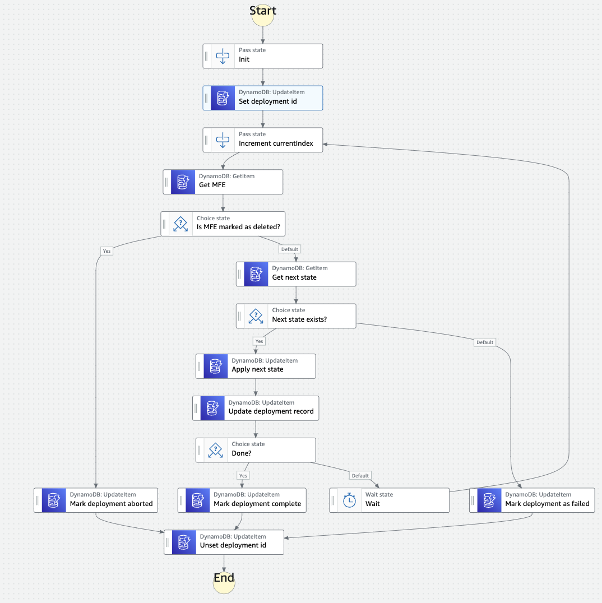

# User Guide

This section describes how to install, configure and use the Frontend Service Discovery on AWS solution.

## Index

- [User Guide](#user-guide)
  - [Index](#index)
  - [Deploying the Solution](#deploying-the-solution)
  - [Accessing the application](#accessing-the-application)
    - [Managing users (only relevant if Cognito is chosen for authentication)](#managing-users-only-relevant-if-cognito-is-chosen-for-authentication)
    - [Making authenticated API requests](#making-authenticated-api-requests)
      - [Cognito](#cognito)
    - [Integrating the solution with other applications using CloudFormation stack outputs](#integrating-the-solution-with-other-applications-using-cloudformation-stack-outputs)
  - [Customising the consumer response](#customising-the-consumer-response)
    - [Consumer Stickyness](#consumer-stickyness)
  - [Creating Deployments](#creating-deployments)
    - [How Deployments Work](#how-deployments-work)
  - [Updating the Solution](#updating-the-solution)
    - [Identify current solution version](#identify-current-solution-version)
    - [Identify the Stack URL to deploy](#identify-the-stack-url-to-deploy)
    - [Minor Upgrades: Perform CloudFormation Stack Update](#minor-upgrades-perform-cloudformation-stack-update)
    - [Major Upgrades: New Deployment](#major-upgrades-new-deployment)
  - [Deleting the Solution](#deleting-the-solution)

## Deploying the Solution

The solution is deployed as an
[AWS CloudFormation](https://aws.amazon.com/cloudformation) template and should
take about 5 to 10 minutes to deploy.

Your access to the AWS account must have IAM permissions to launch AWS
CloudFormation templates that create IAM roles and to create the solution
resources.

> **Note** You are responsible for the cost of the AWS services used while
> running this solution. For full details, see the pricing pages for each AWS
> service you will be using in this sample. Prices are subject to change.

1. Deploy the latest CloudFormation template using the AWS Console by choosing
   the "_Launch Template_" button below for your preferred AWS region. If you
   wish to [deploy using the AWS CLI] instead, you can refer to the "_Template
   Link_" to download the template files.

| Region                                     | Launch Template                                                                                                                                                                                                                                   | Template Link                                                                                                                   | Launch IAM Role Template                                                                                                                                                                                                                           | IAM Role Template Link                                                                                                      |
| ------------------------------------------ | ------------------------------------------------------------------------------------------------------------------------------------------------------------------------------------------------------------------------------------------------- | ------------------------------------------------------------------------------------------------------------------------------- | -------------------------------------------------------------------------------------------------------------------------------------------------------------------------------------------------------------------------------------------------- | --------------------------------------------------------------------------------------------------------------------------- |
| **US East (N. Virginia)** (us-east-1)      | [Launch](https://console.aws.amazon.com/cloudformation/home?region=us-east-1#/stacks/new?stackName=S3F2&templateURL=https://solution-builders-us-east-1.s3.us-east-1.amazonaws.com/frontend-discovery-service/latest/template.yaml)                | [Link](https://solution-builders-us-east-1.s3.us-east-1.amazonaws.com/frontend-discovery-service/latest/template.yaml)           | [Launch](https://console.aws.amazon.com/cloudformation/home?region=us-east-1#/stacks/new?stackName=S3F2-Role&templateURL=https://solution-builders-us-east-1.s3.us-east-1.amazonaws.com/frontend-discovery-service/latest/role.yaml)                | [Link](https://solution-builders-us-east-1.s3.us-east-1.amazonaws.com/frontend-discovery-service/latest/role.yaml)           |
| **US East (Ohio)** (us-east-2)             | [Launch](https://console.aws.amazon.com/cloudformation/home?region=us-east-2#/stacks/new?stackName=S3F2&templateURL=https://solution-builders-us-east-2.s3.us-east-2.amazonaws.com/frontend-discovery-service/latest/template.yaml)                | [Link](https://solution-builders-us-east-2.s3.us-east-2.amazonaws.com/frontend-discovery-service/latest/template.yaml)           | [Launch](https://console.aws.amazon.com/cloudformation/home?region=us-east-2#/stacks/new?stackName=S3F2-Role&templateURL=https://solution-builders-us-east-2.s3.us-east-2.amazonaws.com/frontend-discovery-service/latest/role.yaml)                | [Link](https://solution-builders-us-east-2.s3.us-east-2.amazonaws.com/frontend-discovery-service/latest/role.yaml)           |
| **US West (Oregon)** (us-west-2)           | [Launch](https://console.aws.amazon.com/cloudformation/home?region=us-west-2#/stacks/new?stackName=S3F2&templateURL=https://solution-builders-us-west-2.s3.us-west-2.amazonaws.com/frontend-discovery-service/latest/template.yaml)                | [Link](https://solution-builders-us-west-2.s3.us-west-2.amazonaws.com/frontend-discovery-service/latest/template.yaml)           | [Launch](https://console.aws.amazon.com/cloudformation/home?region=us-west-2#/stacks/new?stackName=S3F2-Role&templateURL=https://solution-builders-us-west-2.s3.us-west-2.amazonaws.com/frontend-discovery-service/latest/role.yaml)                | [Link](https://solution-builders-us-west-2.s3.us-west-2.amazonaws.com/frontend-discovery-service/latest/role.yaml)           |
| **Asia Pacific (Mumbai)** (ap-south-1)     | [Launch](https://console.aws.amazon.com/cloudformation/home?region=ap-south-1#/stacks/new?stackName=S3F2&templateURL=https://solution-builders-ap-south-1.s3.ap-south-1.amazonaws.com/frontend-discovery-service/latest/template.yaml)             | [Link](https://solution-builders-ap-south-1.s3.ap-south-1.amazonaws.com/frontend-discovery-service/latest/template.yaml)         | [Launch](https://console.aws.amazon.com/cloudformation/home?region=ap-south-1#/stacks/new?stackName=S3F2-Role&templateURL=https://solution-builders-ap-south-1.s3.ap-south-1.amazonaws.com/frontend-discovery-service/latest/role.yaml)             | [Link](https://solution-builders-ap-south-1.s3.ap-south-1.amazonaws.com/frontend-discovery-service/latest/role.yaml)         |
| **Asia Pacific (Sydney)** (ap-southeast-2) | [Launch](https://console.aws.amazon.com/cloudformation/home?region=ap-southeast-2#/stacks/new?stackName=S3F2&templateURL=https://solution-builders-ap-southeast-2.s3.ap-southeast-2.amazonaws.com/frontend-discovery-service/latest/template.yaml) | [Link](https://solution-builders-ap-southeast-2.s3.ap-southeast-2.amazonaws.com/frontend-discovery-service/latest/template.yaml) | [Launch](https://console.aws.amazon.com/cloudformation/home?region=ap-southeast-2#/stacks/new?stackName=S3F2-Role&templateURL=https://solution-builders-ap-southeast-2.s3.ap-southeast-2.amazonaws.com/frontend-discovery-service/latest/role.yaml) | [Link](https://solution-builders-ap-southeast-2.s3.ap-southeast-2.amazonaws.com/frontend-discovery-service/latest/role.yaml) |
| **Asia Pacific (Tokyo)** (ap-northeast-1)  | [Launch](https://console.aws.amazon.com/cloudformation/home?region=ap-northeast-1#/stacks/new?stackName=S3F2&templateURL=https://solution-builders-ap-northeast-1.s3.ap-northeast-1.amazonaws.com/frontend-discovery-service/latest/template.yaml) | [Link](https://solution-builders-ap-northeast-1.s3.ap-northeast-1.amazonaws.com/frontend-discovery-service/latest/template.yaml) | [Launch](https://console.aws.amazon.com/cloudformation/home?region=ap-northeast-1#/stacks/new?stackName=S3F2-Role&templateURL=https://solution-builders-ap-northeast-1.s3.ap-northeast-1.amazonaws.com/frontend-discovery-service/latest/role.yaml) | [Link](https://solution-builders-ap-northeast-1.s3.ap-northeast-1.amazonaws.com/frontend-discovery-service/latest/role.yaml) |
| **EU (Ireland)** (eu-west-1)               | [Launch](https://console.aws.amazon.com/cloudformation/home?region=eu-west-1#/stacks/new?stackName=S3F2&templateURL=https://solution-builders-eu-west-1.s3.eu-west-1.amazonaws.com/frontend-discovery-service/latest/template.yaml)                | [Link](https://solution-builders-eu-west-1.s3.eu-west-1.amazonaws.com/frontend-discovery-service/latest/template.yaml)           | [Launch](https://console.aws.amazon.com/cloudformation/home?region=eu-west-1#/stacks/new?stackName=S3F2-Role&templateURL=https://solution-builders-eu-west-1.s3.eu-west-1.amazonaws.com/frontend-discovery-service/latest/role.yaml)                | [Link](https://solution-builders-eu-west-1.s3.eu-west-1.amazonaws.com/frontend-discovery-service/latest/role.yaml)           |
| **EU (London)** (eu-west-2)                | [Launch](https://console.aws.amazon.com/cloudformation/home?region=eu-west-2#/stacks/new?stackName=S3F2&templateURL=https://solution-builders-eu-west-2.s3.eu-west-2.amazonaws.com/frontend-discovery-service/latest/template.yaml)                | [Link](https://solution-builders-eu-west-2.s3.eu-west-2.amazonaws.com/frontend-discovery-service/latest/template.yaml)           | [Launch](https://console.aws.amazon.com/cloudformation/home?region=eu-west-2#/stacks/new?stackName=S3F2-Role&templateURL=https://solution-builders-eu-west-2.s3.eu-west-2.amazonaws.com/frontend-discovery-service/latest/role.yaml)                | [Link](https://solution-builders-eu-west-2.s3.eu-west-2.amazonaws.com/frontend-discovery-service/latest/role.yaml)           |
| **EU (Frankfurt)** (eu-central-1)          | [Launch](https://console.aws.amazon.com/cloudformation/home?region=eu-central-1#/stacks/new?stackName=S3F2&templateURL=https://solution-builders-eu-central-1.s3.eu-central-1.amazonaws.com/frontend-discovery-service/latest/template.yaml)       | [Link](https://solution-builders-eu-central-1.s3.eu-central-1.amazonaws.com/frontend-discovery-service/latest/template.yaml)     | [Launch](https://console.aws.amazon.com/cloudformation/home?region=eu-central-1#/stacks/new?stackName=S3F2-Role&templateURL=https://solution-builders-eu-central-1.s3.eu-central-1.amazonaws.com/frontend-discovery-service/latest/role.yaml)       | [Link](https://solution-builders-eu-central-1.s3.eu-central-1.amazonaws.com/frontend-discovery-service/latest/role.yaml)     |
| **EU (Stockholm)** (eu-north-1)            | [Launch](https://console.aws.amazon.com/cloudformation/home?region=eu-north-1#/stacks/new?stackName=S3F2&templateURL=https://solution-builders-eu-north-1.s3.eu-north-1.amazonaws.com/frontend-discovery-service/latest/template.yaml)             | [Link](https://solution-builders-eu-north-1.s3.eu-north-1.amazonaws.com/frontend-discovery-service/latest/template.yaml)         | [Launch](https://console.aws.amazon.com/cloudformation/home?region=eu-north-1#/stacks/new?stackName=S3F2-Role&templateURL=https://solution-builders-eu-north-1.s3.eu-north-1.amazonaws.com/frontend-discovery-service/latest/role.yaml)             | [Link](https://solution-builders-eu-north-1.s3.eu-north-1.amazonaws.com/frontend-discovery-service/latest/role.yaml)         |

2. If prompted, login using your AWS account credentials.
3. You should see a screen titled "_Create Stack_" at the "_Specify template_"
   step. The fields specifying the CloudFormation template are pre-populated.
   Choose the _Next_ button at the bottom of the page.
4. On the "_Specify stack details_" screen you should provide values for the
   following parameters of the CloudFormation stack:

   - **Stack Name:** (Default: frontend-discovery-service) This is the name that is used to refer to this stack in CloudFormation once deployed.
     **AccessControlAllowOrigin**. The cors configuration for allow-origin for the consumer API. Specify a domain or * to allow all.

   The following parameters are optional and allow further customisation of the
   solution if required:

   - **Stage:** (Default: prod) The stage name used for both APIs.
   - **LogLevel:** (Default: INFO) The log level for Lambda functions deployed for the solution.
   - **DefaultUserEmail:** Optional email for the default user for the ci/cd API. Leave blank to skip creation.
   - **CognitoAdvancedSecurity**: (Default: OFF) The type of Cognito advanced security to enable.
   - **DeleteExpiryMinutes**: (Default: 1440) How long deleted records (Projects, MicroFrontends) will remain in the system before expiry.

   When completed, click _Next_

5. [Configure stack options](https://docs.aws.amazon.com/AWSCloudFormation/latest/UserGuide/cfn-console-add-tags.html)
   if desired, then click _Next_.
6. On the review screen, you must check the boxes for:

   - "_I acknowledge that AWS CloudFormation might create IAM resources_"
   - "_I acknowledge that AWS CloudFormation might create IAM resources with
     custom names_"
   - "_I acknowledge that AWS CloudFormation might require the following
     capability: CAPABILITY_AUTO_EXPAND_"

   These are required to allow CloudFormation to create a Role to allow access
   to resources needed by the stack and name the resources in a dynamic way.

7. Choose _Create Stack_
8. Wait for the CloudFormation stack to launch. Completion is indicated when the
   "Stack status" is "_CREATE_COMPLETE_".
   - You can monitor the stack creation progress in the "Events" tab.
9. Note the _AdminApi_ and _ConsumerApi_ values displayed in the _Outputs_ tab for the stack. These are used to access the application.

## Accessing the application

The solution provides a web user interface and a REST API to allow you to
integrate it in your own applications. If you have chosen not to deploy the Web
UI you will need to use the API to interface with the solution.

### Managing users (only relevant if Cognito is chosen for authentication)

To add more users to the application:

1. Access the [Cognito Console] and choose "Manage User Pools".
2. Select the solution's User Pool (its name is displayed as
   _CognitoUserPoolName_ in the _Outputs_ tab for the CloudFormation stack).
3. Select "Users and Groups" from the menu on the right.
4. Use this page to create or manage users. For more information, consult the
   [Managing Users in User Pools Guide].

### Making authenticated API requests

To use the CI/CD API directly, you will need to authenticate requests using the
Cognito User Pool.

#### Cognito

Note the _CognitoUserPoolID_, _CognitoWebClientID_ and _AdminApi_ parameters displayed in the _Outputs_ tab for the stack.

If you provided a _DefaultUserEmail_ parameter when deploying the stack you will have been emailed a temporary password. Otherwise, you will need to create a user in the AWS Console. You will then need to use the temporary password to set a long term password.

First initiate auth, ensuring the variables are set using the values you took above.

```sh
   aws cognito-idp admin-initiate-auth \
     --user-pool-id $COGNITO_USER_POOL_ID \
     --client-id $COGNITO_USER_POOL_CLIENT_ID \
     --auth-flow ADMIN_USER_PASSWORD_AUTH \
     --auth-parameters USERNAME=$USER_EMAIL_ADDRESS,PASSWORD=$USER_PASSWORD
```

You will receive a challenge response requiring you to update your password. Send a command like the one below to respond. Fill in session with the value from the response to the previous command. Update USER_PASSWORD variable to a new complex password.

```sh
    aws cognito-idp admin-respond-to-auth-challenge \
        --user-pool-id $COGNITO_USER_POOL_ID \
        --client-id $COGNITO_USER_POOL_CLIENT_ID \
        --challenge-name NEW_PASSWORD_REQUIRED \
        --session $SESSION \
        --challenge-responses USERNAME=$USER_EMAIL_ADDRESS,NEW_PASSWORD=$USER_PASSWORD
```

You will receive an authentication response. For future sessions you can authenticate with the first command above.

Use the `IdToken` generated by the previous command to make an authenticated request to the API. For instance, the following command will show a list of existing Projects:

   ```sh
   curl $API_URL/projects -H "Authorization: Bearer $ID_TOKEN"
   ```

An example of programmatic authentication can be seen in the [integration tests](../tests/integration.test.js).

For more information, consult the [Cognito REST API integration guide].


### Integrating the solution with other applications using CloudFormation stack outputs

Applications deployed using AWS CloudFormation in the same AWS account and
region can integrate with Frontend Service Discovery on AWS by using CloudFormation output values.
You can use the solution stack as a nested stack to use its outputs (such as the
API URL) as inputs for another application.

**Note for using exports:** After another stack imports an output value, you
can't delete the stack that is exporting the output value or modify the exported
output value. All of the imports must be removed before you can delete the
exporting stack or modify the output value.

Consult the [exporting stack output values] guide to review the differences
between importing exported values and using nested stacks.

## Customising the consumer response

When a consumer requests a MicroFrontend by calling the Consumer API, a number of steps are taken to determine which version information to return. This can be broken down into two phases, both of which are detailed below and can be customised as required.

### Consumer Stickyness

Upon the first request of a Consumer, they are assigned an USER_ID which is returned to them as a `Set-Cookie` header, which should therefore persist across numerous requests.

The above functionality is implemented as a middleware using [middy](https://middy.js.org/docs/). You can easily write your own middleware if you wish to. Refer to the default code [here](../infrastructure/lambda/consumerApi/userTrackingHandler.js).

### Determining the MicroFrontend for a Consumer

In the case where only one version is currently active, that version will be returned.

Otherwise, the USER_ID as described above is combined with the current active versions to determine a bucket value from 1-100. The bucket value for the Consumer is compared to the traffic distribution configuration for the MicroFrontend to determine the appropriate version to return. Where there is a deployment and the traffic distribution shifts over time, the Consumer will at some point move onto the new version. As the bucket value is consistent for a given set of active versions, the Consumer will then remain on the new version as the deployment continues.

In the case of any error in this process, the version marked `default` will be returned.

The above functionality is implemented [here](../infrastructure/lambda/consumerApi/determineMFE.js) and can be customised as needed.

## Creating Deployments

A deployment can be initiated for a MicroFrontend in two ways:

1. When publishing a version, specify a deployment strategy.
2. Create a Ddeployment for a previously published Version.

Refer to the [API docs](API.md) for more information.

### How deployments work

When a deployment is initiated, the following steps occur:

1. A check is performed to ensure there isn’t a deployment already in progress for the same MicroFrontend. If that’s the case, the API returns a 4xx response.
2. A set of states are calculated based on the requested Deployment Strategy. The supported strategies are duplicated from [AWS SAM options](https://docs.aws.amazon.com/serverless-application-model/latest/developerguide/automating-updates-to-serverless-apps.html).  These states are written to the Deployment DynamoDB table.
3. A Step Functions State Machine execution is initiated, the flow of which is detailed below. In short, it applies the calculated states to the MicroFrontend DynamoDB table until the deployment is complete. When the deployment is completed, the `default` property will be updated to the new version.



## Updating the Solution

To benefit from the latest features and improvements, you should update the
solution deployed to your account when a new version is published. To find out
what the latest version is and what has changed since your currently deployed
version, check the [Changelog].

How you update the solution depends on the difference between versions. If the
new version is a _minor_ upgrade (for instance, from version 3.45 to 3.67) you
should deploy using a CloudFormation Stack Update. If the new version is a
_major_ upgrade (for instance, from 2.34 to 3.0) you may wish to deploy as a new stack and migrate the DynamoDB data across manually.

Major version releases are made in exceptional circumstances and may contain
changes that prohibit backward compatibility. Minor versions releases are
backward-compatible.

### Identify current solution version

You can find the version of the currently deployed solution by retrieving the
`SolutionVersion` output for the solution stack. The solution version is also
shown on the Dashboard of the Web UI.

### Identify the Stack URL to deploy

After reviewing the [Changelog], obtain the `Template Link` url of the latest
version from ["Deploying the Solution"](#deploying-the-solution) (it will be
similar to
`https://solution-builders-us-east-1.s3.us-east-1.amazonaws.com/frontend-discovery-service/latest/template.yaml`).
If you wish to deploy a specific version rather than the latest version, replace
`latest` from the url with the chosen version, for instance
`https://solution-builders-us-east-1.s3.us-east-1.amazonaws.com/frontend-discovery-service/v0.2/template.yaml`.

### Minor Upgrades: Perform CloudFormation Stack Update

To deploy via AWS Console:

1. Open the [CloudFormation Console Page] and choose the Solution by selecting
   to the stack's radio button, then choose "Update"
2. Choose "Replace current template" and then input the template URL for the
   version you wish to deploy in the "Amazon S3 URL" textbox, then choose "Next"
3. On the _Stack Details_ screen, review the Parameters and then choose "Next"
4. On the _Configure stack options_ screen, choose "Next"
5. On the _Review stack_ screen, you must check the boxes for:

   - "_I acknowledge that AWS CloudFormation might create IAM resources_"
   - "_I acknowledge that AWS CloudFormation might create IAM resources with
     custom names_"
   - "_I acknowledge that AWS CloudFormation might require the following
     capability: CAPABILITY_AUTO_EXPAND_"

   These are required to allow CloudFormation to create a Role to allow access
   to resources needed by the stack and name the resources in a dynamic way.

6. Choose "Update stack" to start the stack update.
7. Wait for the CloudFormation stack to finish updating. Completion is indicated
   when the "Stack status" is "_UPDATE_COMPLETE_".

To deploy via the AWS CLI
[consult the documentation](https://docs.aws.amazon.com/cli/latest/reference/cloudformation/update-stack.html).

### Major Upgrades: New Deployment

The process for a major upgrade is as follows:

1. Create a new stack from scratch.
2. Export the data from the old stack to the new stack.
3. Migrate users to the new API endpoints.
4. Delete the old stack.

The steps for performing this process are:

1. Deploy a new instance of the Solution by following the instructions contained
   in the ["Deploying the Solution" section](#deploying-the-solution). Make sure
   you use unique values for Stack Name parameter which differ from existing stack.
2. Migrate Data from DynamoDB to ensure the new stack contains the necessary
   configuration related to MicroFrontends. If your data set is small, it may be easiest to script the transfer of data.
   Alternatively, you can use [S3 Export](https://docs.aws.amazon.com/amazondynamodb/latest/developerguide/S3DataExport.HowItWorks.html)
   and then write a script solely for the import.
4. Review the [Changelog] for changes that may affect how you use the new
   deployment. This may require you to make changes to any software or libraries you have
   that interacts with the APIs.
5. Once all the Admin and Consumer Users are migrated to the new stack, delete
   the old stack.

## Deleting the Solution

To delete a stack via AWS Console:

1. Open the [CloudFormation Console Page] and choose the solution stack, then
   choose "Delete"
2. Once the confirmation modal appears, choose "Delete stack".
3. Wait for the CloudFormation stack to finish updating. Completion is indicated
   when the "Stack status" is "_DELETE_COMPLETE_".

To delete a stack via the AWS CLI
[consult the documentation](https://docs.aws.amazon.com/cli/latest/reference/cloudformation/delete-stack.html).

[api documentation]: API.md
[troubleshooting]: TROUBLESHOOTING.md
[cloudwatch logs pricing]: https://aws.amazon.com/cloudwatch/pricing/
[dynamodb streams]:
  https://docs.aws.amazon.com/amazondynamodb/latest/developerguide/Streams.html
[dynamodb pricing]: https://aws.amazon.com/dynamodb/pricing/on-demand/
[deploy using the aws cli]:
  https://docs.aws.amazon.com/cli/latest/reference/cloudformation/deploy/index.html
[cloudformation console page]:
  https://console.aws.amazon.com/cloudformation/home
[changelog]: ../CHANGELOG.md
[cognito advanced security]:
  https://docs.aws.amazon.com/cognito/latest/developerguide/cognito-user-pool-settings-advanced-security.html
[cognito console]: https://console.aws.amazon.com/cognito
[managing users in user pools guide]:
  https://docs.aws.amazon.com/cognito/latest/developerguide/managing-users.html
[cognito rest api integration guide]:
  https://docs.aws.amazon.com/apigateway/latest/developerguide/apigateway-invoke-api-integrated-with-cognito-user-pool.html
[lambda configuration]:
  https://docs.aws.amazon.com/lambda/latest/operatorguide/computing-power.html
