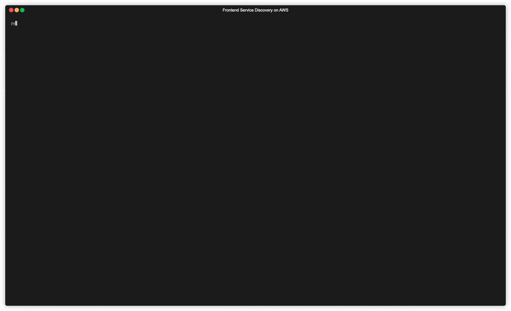

# MFE Demo Util



This example illustrates usage of this solution in the terminal. It features 3 scripts:

**admin-setup.py** - Creates a project containing a MicroFrontend named catalog. It creates two versions, 1.0.0 and 2.0.0. Only version 1.0.0 is active. This script must be run first before the others will work.
**admin-deploy.py** - Initiates a deployment for the created MicroFrontend from version 1.0.0 to 2.0.0.
**consumers** - Simulates 10 users making continual requests to the Consumer API and outputs the versions they receive.

**Note** - It is recommended to use this example in a separate stack deployment to any real resources. Once you have finished with the example, delete the CloudFormation stack.

## Usage

Create a virtualenv

```bash
python3 -m venv .venv
source .venv/bin/activate
pip install -r requirements.txt
```

Run `admin-setup.py` to generate a new project and MFE with 2 versions, of which only 1 is active.

```bash
python admin-setup.py [stack-name]
```

Stack name will default to `frontend-discovery-service` if not specified.

In a second terminal run `consumers.py` - you will see all users getting v1 over time. Leave this process running.

In the original terminal, run `admin-deploy.py` and watch the users in the other terminal start to receive v2 as time progresses.